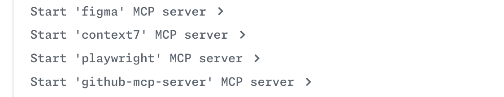
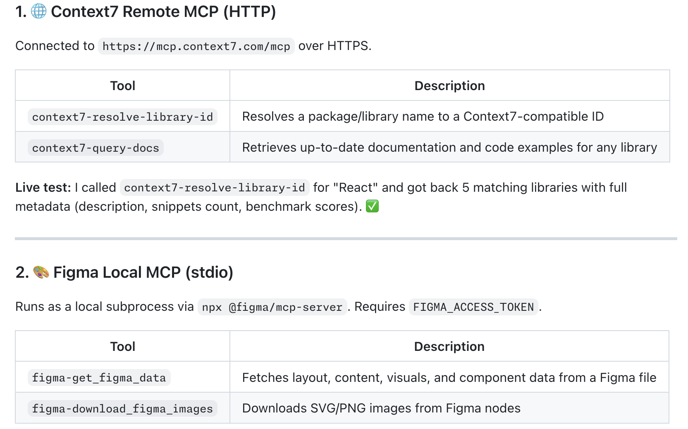

# My Custom Agent with MCP

A working example of a **GitHub Copilot custom agent** that defines its own [Model Context Protocol (MCP)](https://modelcontextprotocol.io/) server connections directly inside the agent profile. No `mcp.json` file required.

The agent demonstrates **2 different MCP connection types** side-by-side:

| Server | Type | Transport | Purpose |
|--------|------|-----------|---------|
| Context7 MCP | Remote | HTTP | Retrieve up-to-date library and framework documentation |
| Figma MCP | Local | stdio | Access Figma design files and components |

---

## ⚠️ Enterprise Scope Requirement

> **This configuration only works when the agent is deployed at the Enterprise scope.**
>
> The `mcp-servers` attribute defined in the custom agent 
> is **ignored** in VS Code and other IDE custom agents.
> To make the agent available across your company you must configure the agents at the Enterprise Account following the steps below. 

---

## How It Works

### Agent profile (`agents/mcp-demo.agent.md`)

The agent is a standard Markdown file with a YAML front-matter block:

```yaml
---
name: MCP Demo Agent
description: >
  Demonstrates how a custom agent can embed MCP server definitions without mcp.json.
tools: ["context7/*", "figma/*"]
mcp-servers:
  context7:
    type: 'http'
    url: 'https://mcp.context7.com/mcp'
    tools: ["*"]
  figma:
    type: 'local'
    command: 'npx'
    args: ['-y', 'figma-developer-mcp', '--figma-api-key=$FIGMA_API_KEY', '--stdio']
    tools: ["*"]
    env:
      FIGMA_API_KEY: ${{ secrets.COPILOT_MCP_FIGMA_API_KEY }}
---
```

- **`mcp-servers` in the agent file** — MCP connectivity is bundled with the agent definition. Users do not need to configure anything in their own `mcp.json` or VS Code settings.
- **`type: http`** — Copilot connects to the MCP server over HTTPS. No local process is spawned; requests are sent to the remote URL.
- **`type: local`** — Copilot starts the MCP server as a local subprocess (via `npx`) and communicates over standard input/output.

---

## Step-by-Step Setup Guide

### Prerequisites

| Requirement | Details |
|-------------|---------|
| GitHub Copilot plan | Enterprise (required for enterprise-scope agents) |
| Enterprise owner access | Needed to configure the `.github-private` repository |

---

### Step 1 — Prepare your enterprise for custom agents

Follow the official GitHub documentation to enable custom agents in your Enterprise Account:

👉 **<https://docs.github.com/en/copilot/how-tos/administer-copilot/manage-for-enterprise/manage-agents/prepare-for-custom-agents>**

---

### Step 2 — Add the agent file to your `.github-private` repository

Copy `agents/mcp-demo.md` from this repository into the `agents/` directory of your `.github-private` repository and merge it into the default branch. **DO NOT** copy this into `.github/agents`. The `agents` folder should be at the root level.

---

### Step 3 — Configure your MCP secrets

In this example, the Figma MCP server requires a Personal Access Token. This is
common in MCP integrations and allows the LLM to authenticate with a third-party
platform to access private resources. Regardless of which platform you are
connecting to, if your MCP needs a secret, follow these steps:

1. In the `.github-private` repository, create a Copilot environment secret:
   - Navigate to **Settings → Environments → copilot** (create if it does not exist).
   - Add a secret named **`COPILOT_MCP_FIGMA_ACCESS_TOKEN`** with the value of your token. Variable names should always start with `COPILOT_MCP_`.

> **Why `COPILOT_MCP_` prefix?**  
> GitHub Copilot coding agent only exposes environment secrets whose names begin with
> `COPILOT_MCP_` to MCP servers. This prevents accidental exposure of unrelated
> secrets.

The Context7 MCP server does **not** need any additional token configuration for
this example.

If you're using Figma and want to generate a Personal Access Token, review the
documentation [here](https://help.figma.com/hc/en-us/articles/8085703771159-Manage-personal-access-tokens).

---

### Step 4 — Configure firewall access in Copilot settings

Depending on your enterprise network policy and MCP requirements, you may need to
allow outbound access to specific domains used by your MCP servers.

For this example, verify that the required domains are allowed in your Copilot
network/firewall configuration:

1. `mcp.context7.com` (Context7 remote MCP endpoint)
2. `api.figma.com` (Figma API access for Figma MCP use cases)

If your organization uses additional MCPs, add their required domains as well.

---

### Step 5 — Verify the agent is available

1. Navigate to **<https://github.com/copilot/agents>**.
2. In the dropdown menu in the prompt box, select any repository for the test
   (or the source repository `.github-private`).
3. Click the agent selector icon and confirm **MCP Demo Agent** appears in the list.

---

### Step 6 — Test the agent

1. Select **MCP Demo Agent** from the dropdown.
2. Send a prompt such as:

   ```
   Hello! Show the MCP tools available in this agent.
   ```

3. The agent should:
   - Show the MCPs that were initiated in the session.
    
   - List Context7 and Figma MCP tools.
       

---

## Further Reading

- [Creating custom agents for Copilot coding agent](https://docs.github.com/en/copilot/how-tos/use-copilot-agents/coding-agent/create-custom-agents)
- [Custom agents template repository](https://github.com/docs/custom-agents-template)
